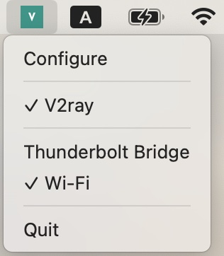

# proxymanager

A tool to make managing v2ray process and network proxy (socks proxy) easy.

## Snapshots

### Configuration


### System Trap Menu



## How to use

1. Download the v2ray release from somewhere else and unzip it to a local directory.
2. Update the configuration file `config.json` with your favorite editor.
3. Download `proxymanager` or build it by yourself.
4. Run `proxymanager`, and configure `V2ray Directory`.
5. Start `v2ray` and toggle on socks proxy on the system trap menu.

The persisted configuration and logs are under `~/.proxymanager/` directory.

## How to build

The app is written in Go. So Go must be installed. Then run the following commands to build and package:

```bash
make install-deps
make package-darwin
```
