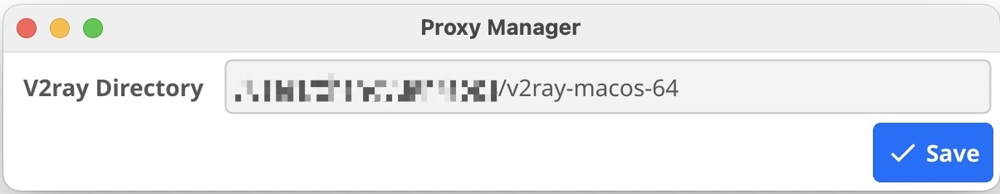

# proxymanager

A simple tool to make managing v2ray process and network proxy (socks proxy) easy.

## Snapshots

### Configuration



### System Trap Menu


## How to build

The app is written in Go. So Go must be installed. Then run the following commands to build and package:

```bash
make install-deps
make package
```

The packaged `proxmanager` is under `proxymanager.app`.

## How to use

You can build the app on your own machine, or download `proxymanager.app` from Github Actions' artifacts or [Github Releases](https://github.com/zhangyuan/proxymanager/releases). As the package doesn't have valid signature, so the executable `proxymanager` must be manually granted with execution permission as below:

```bash
chmod +x proxymanager.app/Contents/MacOS/proxymanager
```

Follow the steps below to run the app.

1. Download the v2ray release from somewhere else and unzip it to a local directory.
2. Update the configuration file `config.json` with your favorite editor.
3. Move `proxymanager.app` to `/Applications` directory.
4. Run `proxymanager`, and configure `V2ray Directory`.
5. Start `v2ray` and toggle on socks proxy on the system trap menu.

The persisted configuration and logs are under `~/.proxymanager/` directory.
